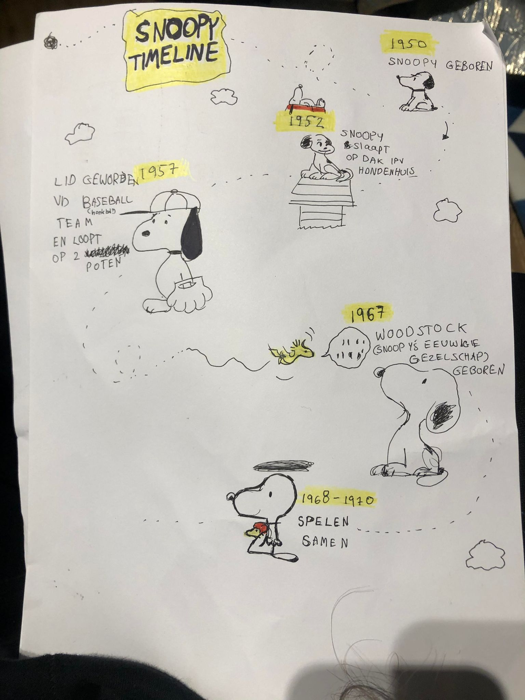
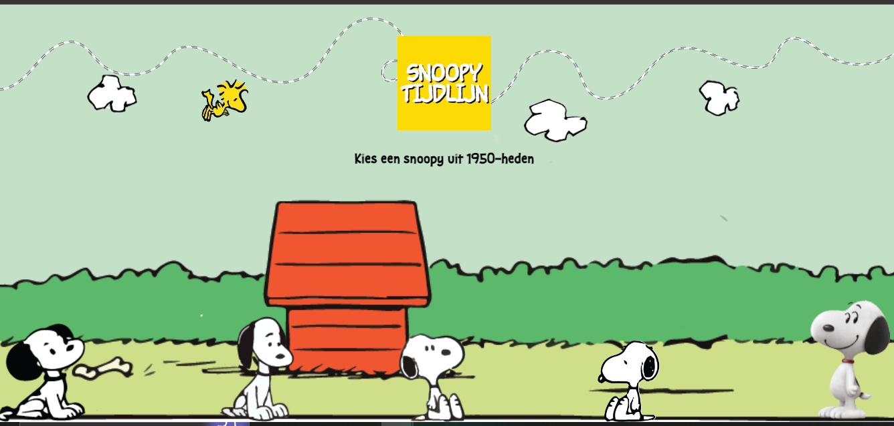

# Procesverslag
Eerste feedback sessie met Rutger, tweede feedback sessie met Deon, derde feedbacksessie met Keisha. . 

## Jij

### Ontwerper:
Vita Sznaider

#### Je startniveau:
Mijn startniveau is blauw

# Je plan

  
De eerste versie/schets van mijn ontwerp & mijn persoonlijke uitdaging

  ### De eerste versie/schets:
  

  ### Je ambitie: 
  Aan deze technieken/punten wil ik werken:
  - Problemen zelf kunnen oplossen in de code adhv stack-overflow
  - mijn eigen stijl ontwikkelen
  - Betere werkritme behalen

## Voortgang/Feedback 1

  
Mijn bevindingen + wijzigingen (minimaal 5)

  ### Bevinding 1:
  In de eerste feedback sessie zei Rutger dat mijn schets leuk is maar dat ik na moet denken over wat hem uniek maakt.

  #### oplossing:
  Ik heb de vormgeving van Snoopy overgenomen met kromme lijnen en een naïef opmaak. 

  ### Bevinding 2:
  Tip: Je kan de "comic" vormgeving aanhouden met vierkante blokken en horizontal scrolling
  #### oplossing:
  Ik heb de ordered list in een flexbox gestopt en deze wordt horizontaal weergegeven
  

  ### Bevinding 3:
  Je zou ook de tekenstijl kunnen toevoegen en gebruik maken van zwart/wit van de oude snoopy
  #### oplossing:
  Ik heb de tekenstijl toegevoegd door consistent te zijn met de svg's die ik plaats en de minimalistische tekenstijl. 
 
  ### Bevinding 4:
  Je moet nadenken over interacties
  #### oplossing:
  Ik ging meteen aan de slag en heb een animatie van vliegende woodstock gemaakt. 

  ### Bevinding 5:
  Goed idee, snoopy heeft veel uiterlijken om uit te werken.  
  #### oplossing:
  Ik heb verschillende vormen van Snoopy gekozen om in mijn tijdlijn weer te geven, om een overzichtelijk beeld te geven. 

  ### Bevinding 6:
  Lijkt te veel op een tijdlijn
    
  #### oplossing:
  Snoopy fases als actuele snoopy's uit de geschiedenis weergegeven
    

## Voortgang/Feedback 2

  
Mijn bevindingen + wijzigingen (minimaal 5)

  
  ### Bevinding 1:
  Deon zei dat mijn kleurenpalet rood mist
  #### oplossing:
  Ik heb een rood huisje van Snoopy als achtergrond toegevoegd

  ### Bevinding 2:
  Er waren geen states.

  #### oplossing:
  Ik heb een hover state toegevoegd waarbij de buttons groter worden. Voor focus heb ik geexperimenteerd maar was mij niet echt gelukt, was alsnog tevreden met dat je via tab de buttons nog steeds kan selecteren. 

  ### Bevinding 3:
  Alt text miste in sommige afbeeldingen

  #### oplossing:
  Alt text aan alle foto's toegevoegd.

  ### Bevinding 4:
  Kleuren waren niet met variabelen (CSS properties) gemaakt
  #### oplossing:
  Alle kleuren aangepast en staan nu in de properties.
  

  ### Bevinding 5:
  Er zijn pixels bij sommige plekken.
  #### oplossing:
  Ik heb de pixels vervangen door toegestaan relative units (meestal em)

  ### Bevinding 5:
  *Je hebt Snoopy gekozen, niet woodstock*
  #### oplossing:
  Ik heb verder meer gefocust op Snoopy zelf dan zijn beste vriend, ook al doen ze alles samen. Interacties met Snoopy bedacht en gemaakt.

## Voortgang/Feedback 3

  
Mijn bevindingen + wijzigingen (minimaal 5)

  
  ### Bevinding 1:
  In de CSS miste er per onderdeel een kopje
  #### oplossing:
  Heb de code geformat met CSS formatter en beautify, spaties toegevoegd en kopjes.

  ### Bevinding 2:
  Bronnen misten 
  #### oplossing:
  Heb de bronnen toegevoegd

  ### Bevinding 3:
  de wolken vliegen over de plaatjes heen
    
  #### oplossing:
  Heb de wolken bij de details pagina's weggehaald/uitgezet (display:none gegeven aan de header)
    
 
 
  ### Bevinding 2:
  Secties die ik niet ga gebruiken staan nog overal
  #### oplossing:
  Heb de regels die ik nier had gebruikt weggehaald.

## Reflectie

  
Mijn eindresultaat & persoonlijke ontwikkeling

  ### Je uitkomst - karakteristiek screenshot(s):
  

  ### Dit ging goed/Heb ik geleerd: 
Woodstock animatie is waar ik de meeste complimenten voor heb gekregen.

Het ontwerp is mooier geworden dan mijn vrienden en familie hebben bedacht. 

Ik ben nu gewend aan de werkritme waaraan ik wou wennen.

ik heb meerdere dingen geleerd, waaronder:
-voor bijna elk probleem is een *stack overflow* post. In hoeverre de code die daar aangeboden wordt betrouwbaar/ethisch is is aan de ontwerper te bepalen. 
-met svg's hebben we meer controle over de *texture* van wat we proberen te creeren. 
-*offset path* is de manier om een element op jouw manier te animeren.
-last-of-type(2) bestaat niet, alleen *nth-last-of-type(2)*.
-Het is onderandere daarom verstandig om geen selectors van last-of-type te gebruiken als je nog niet klaar bent met je 'types.'
-Goed om vanuit het hart te werken omdat je dan meer zin hebt in het project, ipv constant betere en ingewikkeldere codepens te zoeken.
-kleuren moeten in root:.(css properties)
  

  ### Dit was lastig/Is niet gelukt:
Aan het einde van het project kreeg ik steeds de plaatjes van de strips in beeld bij mijn index. Dat was niet de bedoeling.
Ik weet bijna zeker dat er een manier is om ze eenmaal te verstoppen zonder *veel regels code voor elk element*. 
Ik had ook graag andere achtergronden en spraak svg'tjes gemaakt. Aangezien het onverwachte urenlang duurde voordat ik de comics weer zelfstandig weg kreeg van mijn index maak ik me zorgen dat het net vlakbij de deadline mis kan gaan, die risico nemen doe ik niet. Maar ook omdat de pagina anders te druk wordt.

  
  

## Bronnenlijst

1. Graham, G. (2019, 4 december). offset-path. CSS-Tricks. https://css-tricks.com/almanac/properties/o/offset-path/
2. Wikipedia contributors. (2022, 3 september). Woodstock (Peanuts). Wikipedia. https://en.wikipedia.org/wiki/Woodstock_(Peanuts)
3. Snoopy The Peanuts Movie Transparent Cartoon. (z.d.). Gallery Yopriceville. Geraadpleegd op 10 november 2022, van https://gallery.yopriceville.com/Free-Clipart-Pictures/Cartoons-PNG/Snoopy_The_Peanuts_Movie_Transparent_Cartoon
4. Schulz, C. (2016). The Complete Peanuts Vol. 25: 1999–2000. Adfo Books.
5. Schulz, C., Keillor, G. & Cronkite, W. (2014). The Complete Peanuts 1950-1954 Gift Box Set. Adfo Books.
6. Schulz, C. Alle Complete Peanuts Vol 1-25 1950-1999

